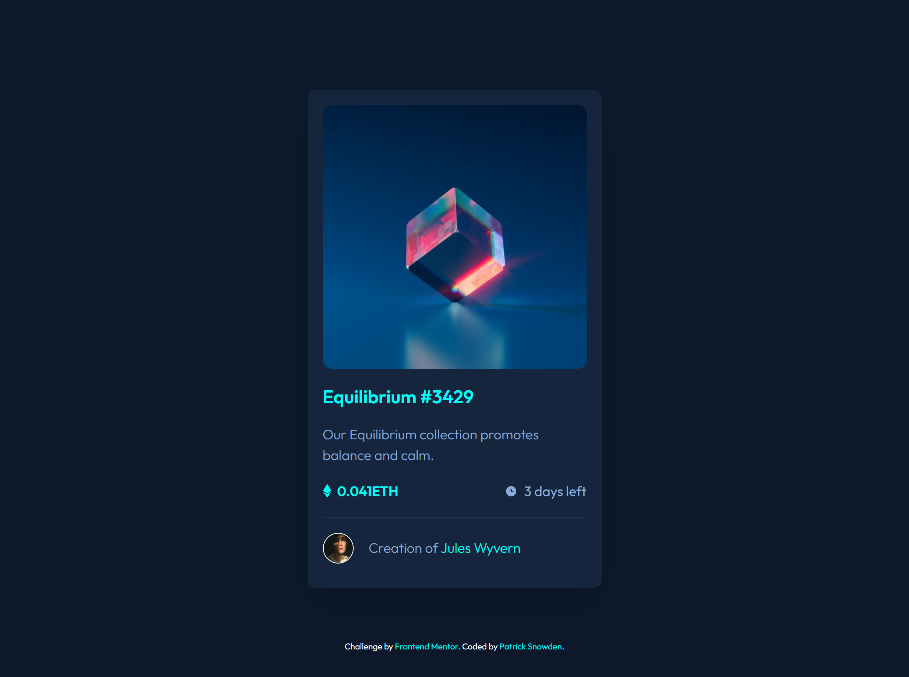

# NFT Preview Card Component
This is a solution to the <a href="https://www.frontendmentor.io/challenges/nft-preview-card-component-SbdUL_w0U/hub/nft-preview-card-component-2syBOclQM">NFT Preview Card Component Frontend Mentor challenge</a>.

[Click here](https://nftchallengefem.netlify.app/) to see the solution.

## How It's Made:

**Tech used:** React, Tailwind, HTML, CSS, JavaScript

## Lessons Learned:

I wanted to improve my familiarity with React and Tailwind. I plan to continue using both for most of the Frontend Mentor challenges. 
